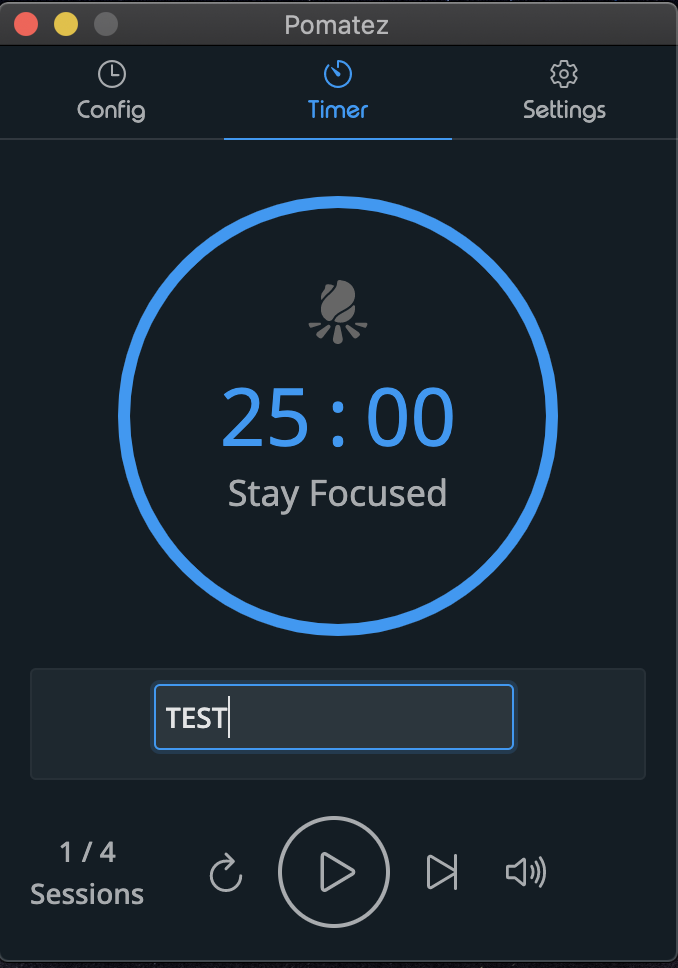
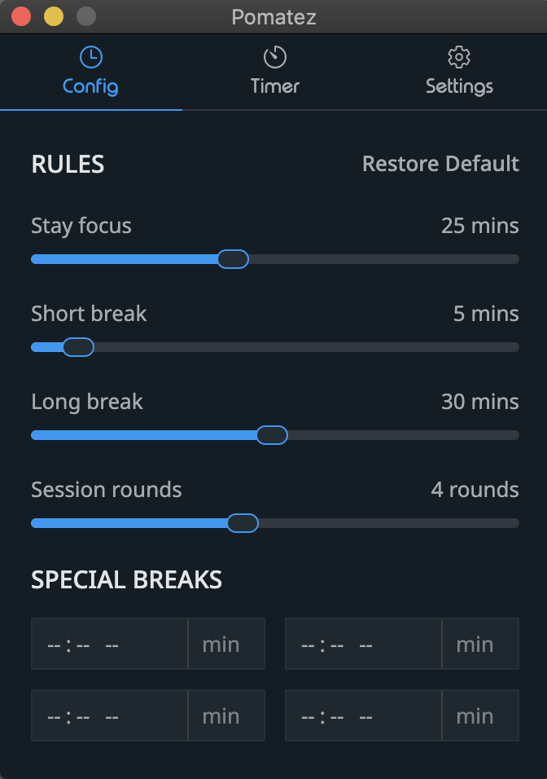
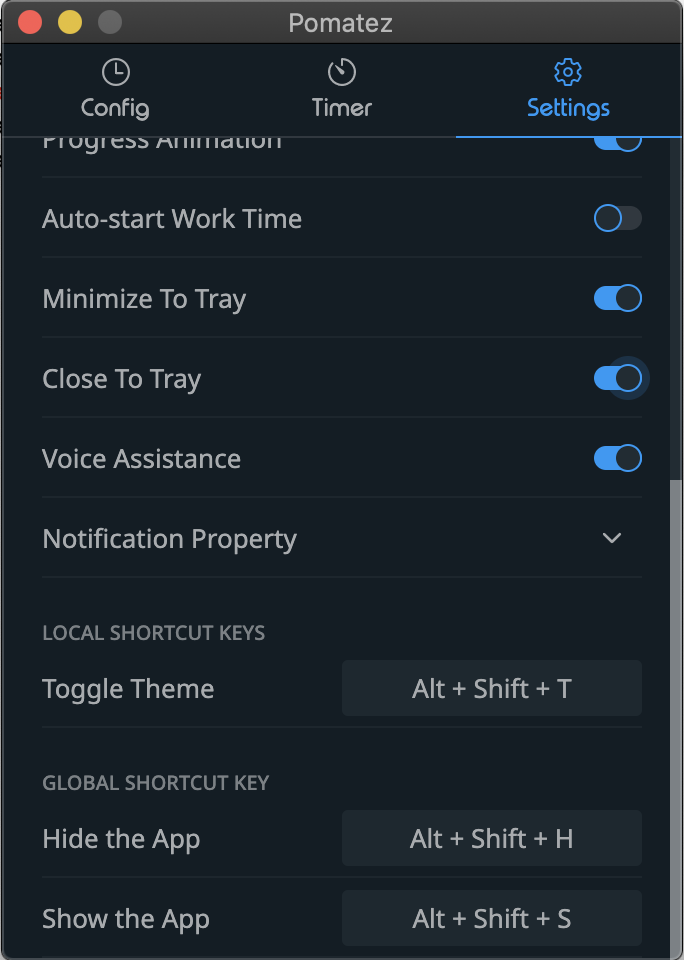

# Goal

tl;dr. The goal of the app is to provide a **minimal Pomodoro timer** Jump to [Flow of the app](#flow-of-the-app)

---

## Long version

It started with the want to have a minimal Pomodoro app. A simple app lets me configure the intervals, run the timer, and provide notifications. I started by checking the available Pomodoro apps in the app store. However, most of the apps make money by tracking the activities & selling the usage data. While I understand the developers of those who have to make money, I wasn't ready to share my data like many others. So I didn't go with any of the apps available in the app store. Moreover, the app store's apps have too many features, which I wasn't looking for.

My next immediate step was to identify any _open-source_ apps available in **GitHub**. I evaluated a few and finally arrived at [Pomatez](https://github.com/roldanjr/pomatez), which fits the requirements. It's simple to use, has configurable timers, provides notifications & it didn't collect any usage data other than the number of users. One additional feature was the in-built `task-list,` allowing the user to create task lists and the drag and drop to change the task priorities. It was a well-designed feature and attractive to people who want to use one app for managing todos & Pomodoro timer. However, I already have a workflow to manage my todos, and I didn't like introducing one more app to the mix. Luckily **Pomatez** is an open-source project, thanks to [Rolden Montilla Jr](https://github.com/roldanjr). So I opted to modify the app to suit the minimalistic needs.

The goal of the app is to provide a **minimal Pomodoro timer**

## Flow of the app

1. Assume the User has their own preferred app/workflow to manage **todo**
2. Pomatez app provides a text box to enter the task the user wants to start
3. After entering the task, the user can start the task
4. Unless the user changes the task name, the task remains the same
5. When the user completes a task (in mid-way of a Pomodoro timer or after one), the task can be reset
6. The user can then add the new task name and start another timer

Based on the app's flow, I hid the task list and added a text box to enter the task that needs to be worked on. Also, I hid a few other configurations & shortcuts that are not relevant or redundant in the new app. I was happy with the changes and started using it. My original intention was to leave it as modified/personalized.
While sharing the story with a few of my colleagues who share similar minimalistic principles, I received a lot of positive feedback. They wanted to use the app, as well. Additionally, they were interested in having one more feature, which is seeing how much time they are spending on a task most simply. i.e., a CSV file. So that they have some kind of history of their work and also they own their data.

So the additional requirement is _to allow the user to track how much time it took to complete a task, should they choose to. This tracking information can be exported as CSV, which the user can use it for any of their other tools._ While I don't know how it can be achieved, the open-source community is enormous, and there may be folks who know.

## Stripped down version of Pomatez

This repo is a stripped-down version of [Pomatez](https://github.com/roldanjr/pomatez) App.

|               Timer                |                Config                |                 Settings                 |
| :--------------------------------: | :----------------------------------: | :--------------------------------------: |
|  |  |  |

## Credits

- Credits goes to [Rolden Montilla Jr](https://github.com/roldanjr) for the [Pomatez](https://github.com/roldanjr/pomatez) repo

---
